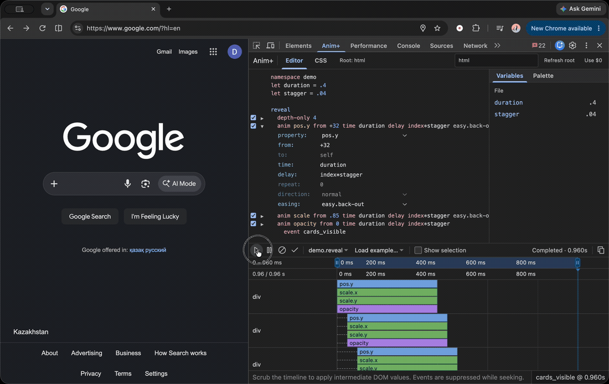

# Anim+ Chrome Extension

A DevTools editor for DOM animations: text commands, an interactive Bezier editor, a timeline, live mouse bindings, and CSS export.

## Demo

[](docs/media/demo.mp4)

[Watch the full-size video](docs/media/demo.mp4) · [Anim+ language standard](https://github.com/dev-denis-korsunov/animplus)

## Build and install

Requires Node.js 22.12+.

```sh
npm ci
npm run build
```

Open `chrome://extensions`, enable **Developer mode**, and choose **Load unpacked** → `packages/editor/extension`. Open DevTools → **Anim+**, select a root element, then load an example or write an animation and press **Play**.

```sh
npm test
```

`packages/editor` contains the extension; `packages/runtime` contains the bundled Anim+ engine so this repository builds independently. The [playground](https://github.com/dev-denis-korsunov/animplus.js) contains the DOM targets for the examples, including the cursor-following dog.
